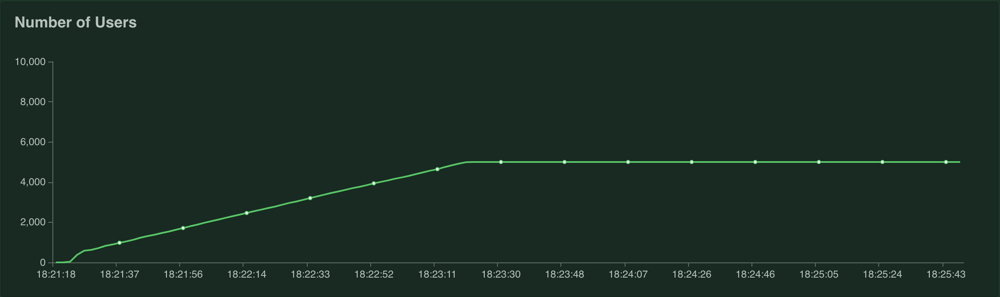
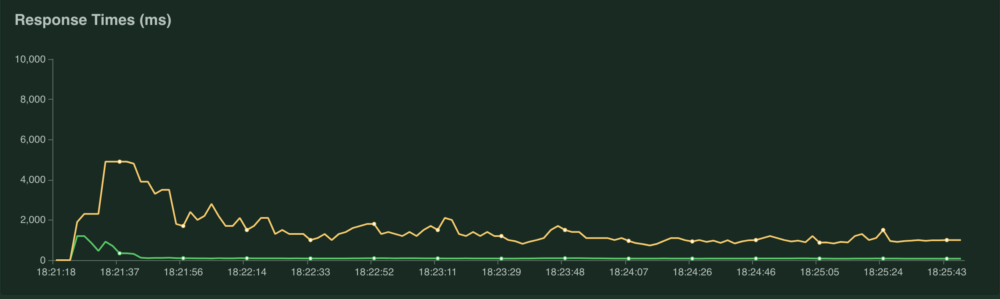
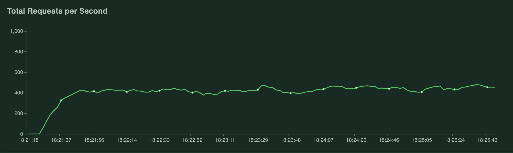
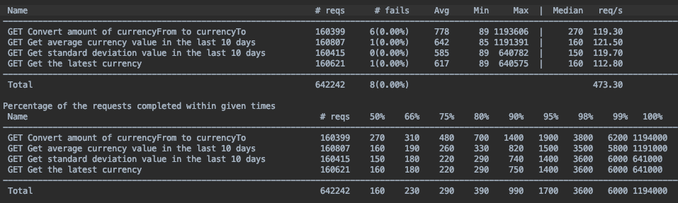

# Currency Converter Service

## Challenge

Java REST application for the currency conversion.

Task with "CLIENT" described functionalities/Use Cases is :

Using https://exchangeratesapi.io/ API as source of data create Exchange Rate Service that will offer following functionality:

- Will allow a South African Republic national to check how much he has to pay for INPUT amount of Norwegian Krone

- Allow an American to Calculate average price of Brazilian Real between 12/24/2017 and 12/27/2017

- Will display currency with highest stability in price quoted against Croatian Kuna for GIVEN period

Assumptions :

Current exchange rates served by exchangeratesapi.io are changed every 60 seconds

https://exchangeratesapi.io/ can serve up to 100 requests per second and your service needs to serve up to a 1000

You have up to 5 machines you can use to run necessary systems

Historical data doesn’t change

In your current setup you don’t have ability to create a persistent storage

## Prerequisites and Solution

- [x] Code: Java 8, Spring Boot, Spring Web Framework, Gradle
- [x] Cache: Ehcache
- [x] Functional tests: Spock, Groovy, Spring Mock MVC
- [x] Algorithm used to calculate the highest stability in price: Standard Deviation
- [x] Deployed: AWS ([Maybe it is still here](http://currency.rtzvznrmps.eu-west-1.elasticbeanstalk.com/convert?fromamount=1&to=EUR&from=PLN))
- [x] Performance tests: LOCUST and custom tests in Python
- [x] Solution time: 3 days

## Running application locally

- use gradle: ./gradlew bootJar (or use already prepared currencyExchangeService-0.1.1.jar)
- java -jar build/libs/currencyExchangeService-0.1.1.jar

#### Requests examples ready to play with on localhost

- http://localhost:8080/convert?fromamount=2&to=PLN&from=USD
- http://localhost:8080/average?to=PHP&from=AUD&start_at=2019-02-02&end_at=2019-02-13
- http://localhost:8080/sd?start_at=2018-01-01&end_at=2018-01-20&base=PLN
- http://localhost:8080/latest?base=EUR

## Running performance tests

- use Python and pip3 to install Flask and Locustio
- run dedicated script in performance directory: ./performance/run_tests.py

Table with LOCUST performance results summary

### What left?

- [ ] More tests - unit and functional tests
- [ ] Code refactoring 